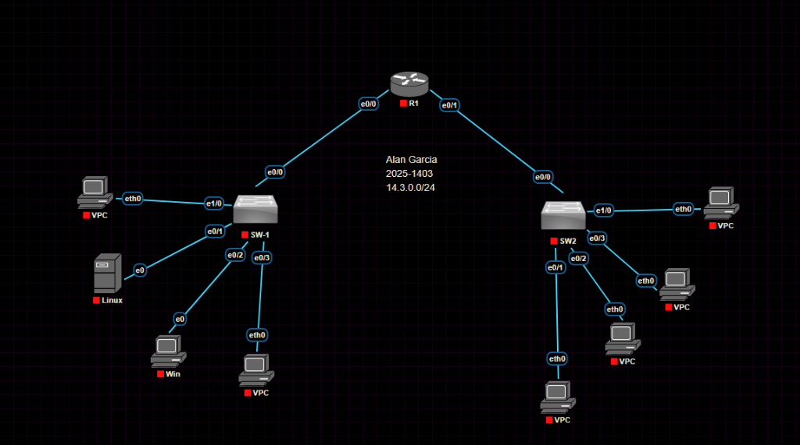
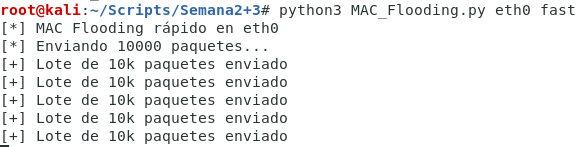
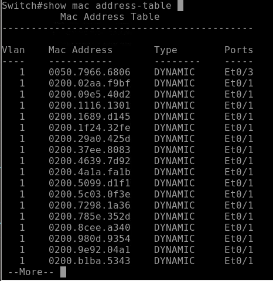

# Informe Técnico Profesional: Simulación de Ataque DoS mediante MAC Flooding
**Asignación:** P4  
**Autor:** Alan Garcia  
**Matrícula:** 2025-1403  
**Fecha:** 5 de junio de 2026 
**Enlace del video:** https://youtu.be/WfAKosdicyE 

---

## 1. Objetivo del Laboratorio
El objetivo de este laboratorio es analizar el comportamiento de las tablas de memoria direccionable por contenido (CAM o *MAC Address Table*) de los conmutadores de capa 2 al ser expuestas a una inundación masiva de tramas Ethernet con direcciones físicas origen aleatorias (MAC Flooding). Asimismo, se busca comprobar cómo este agotamiento de recursos degrada la seguridad de la red al forzar al switch a actuar como un repetidor (hub) y aplicar políticas de contención robustas mediante *Port Security* en equipos Cisco.

---

## 2. Documentación de la Red y Topología

### Detalles del Direccionamiento Lógico (Basado en Matrícula: 2025-1403)
Tomando como base la matrícula **1403** (direccionamiento IP inicial **14.3.0.0**), la red local se segmenta en dos VLANs a través del router **R1** (Inter-VLAN Routing) utilizando subredes completas de máscara de 24 bits:

*   **VLAN 10 - Red de Administración y Servidores (SW-1 / Lado Izquierdo):** `14.3.0.0/24` (Rango útil: `14.3.0.1` - `14.3.0.254`)
*   **VLAN 20 - Red de Usuarios Finales (SW2 / Lado Derecho):** `14.3.1.0/24` (Rango útil: `14.3.1.1` - `14.3.1.254`)

### Tabla de Direccionamiento de Dispositivos (Entorno SW-1)
Para esta demostración, el ataque se origina desde el host Linux conectado al switch **SW-1** en la VLAN por defecto (VLAN 1):

| Dispositivo | Interfaz Física | Dirección IP | Dirección MAC | VLAN ID | Rol / Descripción |
| :--- | :--- | :--- | :--- | :--- | :--- |
| **R1** | `Ethernet0/0` | `14.3.0.1` | `aa:bb:cc:00:01:00` | 1 | Puerta de Enlace (VLAN 1) |
| **Linux (Atacante)**| `Ethernet0` | `14.3.0.11` | `02:xx:xx:xx:xx:xx` (Falsas) | 1 | Host inyector de tramas (Kali Linux) |
| **VPC-3 (Víctima)** | `Ethernet0` | `14.3.0.13` | `00:50:79:66:68:06` | 1 | PC Virtual de usuario legítimo |

### Diagrama de Topología Lógica (PNetLab)
La infraestructura se ha construido bajo la herramienta de emulación PNetLab utilizando equipos de red Cisco y hosts finales:



---

## 3. Objetivo del Script y Requisitos

### Objetivo del Script
El script `MAC_Flooding.py` tiene como propósito realizar una inyección masiva de tramas Ethernet con direcciones MAC origen y destino generadas de forma aleatoria, con el fin de saturar la memoria caché **CAM (Content Addressable Memory)** del switch de red. 

El script ofrece tres modos de ataque:
1.  **normal:** Inundación estándar paquete por paquete con un retraso configurable.
2.  **fast:** Generación inicial de una lista de 10,000 paquetes únicos en memoria y su posterior envío continuo en ráfagas de alta velocidad para maximizar el consumo de la tabla CAM en pocos segundos.
3.  **vlan:** Envío de paquetes etiquetados con cabeceras **802.1Q** para saturar las tablas CAM de múltiples VLANs específicas o realizar ataques de salto de VLAN (*VLAN Hopping*).

Cuando la tabla CAM se llena por completo, el switch no puede aprender nuevas direcciones. Al recibir una trama dirigida a una MAC que no está en su tabla, el switch se ve obligado a inundar (*flood*) dicha trama por todos los puertos activos de la VLAN (actuando como un Hub). Esto permite al atacante capturar de forma pasiva (con Wireshark) información de otros hosts que normalmente estaría protegida en un switch.

### Requisitos del Sistema
*   **Librerías de Python:** `scapy` para la creación y manipulación rápida de tramas en la capa de enlace de datos.
    ```bash
    pip3 install scapy
    ```
*   **Permisos de Ejecución:** El script debe ejecutarse con privilegios administrativos (`sudo` o root) en Linux, debido a que requiere el envío de tramas de red directas a través de sockets crudos.

---

## 4. Parámetros Usados y Funcionamiento del Script

### Parámetros CLI del Script
El script recibe los siguientes argumentos posicionales a través de la terminal:
*   `interface` (Obligatorio): Interfaz de red local (para este entorno: `eth0`).
*   `modo` (Opcional): Modo de ejecución del script, configurándose en `fast` para el envío en ráfagas de 10,000 tramas.
*   `opciones` (Opcional): Parámetros adicionales (como el ID de la VLAN de destino si se utiliza el modo `vlan`).

### Lógica de Funcionamiento del Modo Rápido (fast)
1.  **Generación previa en memoria:** El script crea una lista interna de 10,000 objetos de paquetes en memoria para evitar el retardo de la generación aleatoria de MACs en tiempo de ejecución.
2.  **Estructuración del Paquete:** Cada paquete contiene:
    *   Una dirección MAC origen aleatoria de ámbito local (ej. comenzando por `02:`).
    *   Una dirección MAC destino aleatoria.
    *   Cargas útiles IP y UDP genéricas para que el switch procese el paquete como tráfico válido de red.
3.  **Bucle de inyección:** Inicia un bucle infinito enviando lotes completos de 10,000 tramas al switch mediante la función de envío de Scapy (`sendp`).

---

## 5. Capturas de Pantalla y Demostración

### 1. Ejecución del Ataque de Inundación de MACs (Kali Linux)
El script se ejecuta utilizando la interfaz de red local `eth0` bajo el modo ultra-rápido (`fast`):
```bash
root@kali:~/Scripts/Semana2+3# python3 MAC_Flooding.py eth0 fast
[*] MAC Flooding rápido en eth0
[*] Enbiando 10000 paquetes...
[+] Lote de 10k paquetes enviado
[+] Lote de 10k paquetes enviado
[+] Lote de 10k paquetes enviado
[+] Lote de 10k paquetes enviado
[+] Lote de 10k paquetes enviado
```
*(Se observa en la captura cómo la herramienta inyecta miles de tramas Ethernet a través del puerto origen en ráfagas continuas).*



### 2. Tabla de Direcciones MAC Saturada en el Switch (Switch Cisco)
Al ejecutar el comando de diagnóstico en el switch de acceso, se constata la saturación de la tabla de direcciones MAC. El puerto del atacante (`Et0/1`) ha aprendido cientos de direcciones físicas falsas (iniciadas por el prefijo `0200.`), desplazando cualquier registro legítimo previo debido al límite físico de almacenamiento de la tabla CAM del equipo:

```
Switch#show mac address-table
          Mac Address Table
-------------------------------------------

Vlan    Mac Address       Type        Ports
----    -----------       ----        -----
   1    0050.7966.6806    DYNAMIC     Et0/3
   1    0200.02aa.f9bf    DYNAMIC     Et0/1
   1    0200.09e5.40d2    DYNAMIC     Et0/1
   1    0200.1116.1301    DYNAMIC     Et0/1
   1    0200.1689.d145    DYNAMIC     Et0/1
   1    0200.1f24.32fe    DYNAMIC     Et0/1
   1    0200.29a0.0425    DYNAMIC     Et0/1
   1    0200.37ee.8083    DYNAMIC     Et0/1
   1    0200.4639.7d92    DYNAMIC     Et0/1
   1    0200.4a1a.fa1b    DYNAMIC     Et0/1
   1    0200.5099.d1f1    DYNAMIC     Et0/1
   1    0200.5c03.0f3e    DYNAMIC     Et0/1
   1    0200.7298.1a36    DYNAMIC     Et0/1
   1    0200.785e.352d    DYNAMIC     Et0/1
   1    0200.8cee.a340    DYNAMIC     Et0/1
   1    0200.980d.9354    DYNAMIC     Et0/1
   1    0200.9e92.04a1    DYNAMIC     Et0/1
   1    0200.b1ba.5343    DYNAMIC     Et0/1
 --More--
```



---

## 6. Contra-medidas y Mitigación

### Análisis de la Vulnerabilidad
Los switches registran dinámicamente las direcciones MAC de origen de las tramas recibidas en sus puertos para optimizar el reenvío. Dado que no existe validación de la autenticidad de las tramas, un único puerto puede saturar el espacio asignado en la memoria direccionable CAM, provocando que el switch falle de forma insegura (*fail-open*) y comience a inundar todo el tráfico unicast a todos los puertos activos de esa VLAN.

### Mitigación en Switches Cisco (Port Security)
La contramedida directa y efectiva para evitar el MAC Flooding es limitar la cantidad de direcciones MAC permitidas en los puertos de acceso mediante la configuración de **Port Security** (Seguridad de Puerto).

#### Comandos de Configuración (Cisco IOS)

```ios
! Entrar en modo de configuración global
Switch# configure terminal

! Configurar el puerto de acceso del usuario (para SW-1, interfaz Ethernet 0/1)
Switch(config)# interface Ethernet 0/1
Switch(config-if)# switchport mode access
Switch(config-if)# switchport port-security

! Definir la cantidad máxima de direcciones MAC permitidas en la interfaz (ej. máximo 2)
Switch(config-if)# switchport port-security maximum 2

! Configurar el método de aprendizaje dinámico (Sticky)
! Esto almacena de forma persistente las MACs legítimas en la configuración de ejecución
Switch(config-if)# switchport port-security mac-address sticky

! Establecer la acción ante violación de seguridad
! Shutdown apaga físicamente el puerto (err-disable) y genera un mensaje syslog
Switch(config-if)# switchport port-security violation shutdown
Switch(config-if)# end

! Guardar cambios en la configuración
Switch# write memory
```

### Verificación de la Mitigación
1.  Cuando el host del atacante conectado a `Ethernet0/1` inicia el script en modo `fast`, el switch permitirá las primeras dos direcciones MAC.
2.  Al recibir la tercera dirección MAC origen diferente, la política de **Port Security** se activará de inmediato.
3.  El switch colocará la interfaz `Ethernet0/1` en estado **err-disabled** (LED naranja/apagado físico), impidiendo cualquier envío de tramas posterior.
4.  La tabla de direcciones MAC del switch mantendrá únicamente los registros legítimos anteriores y el tráfico de la red seguirá funcionando de manera segura y privada.

---

## 7. Entregables Multimedia
*   **Repositorio GitHub:** `https://github.com/imAlanG16/MAC_Flooding`
*   **Enlace de YouTube:** `https://youtu.be/WfAKosdicyE`
    *   *Video de Demostración:* Muestra la topología en PNetLab con nombre, matrícula y direccionamiento IP configurado. Se visualiza la hora y fecha del sistema, mi explicación detallada sobre cómo el script inyecta tramas y llena la tabla CAM, la visualización de la tabla saturada (`show mac address-table`), y la posterior configuración y verificación de la contramedida Port Security.
